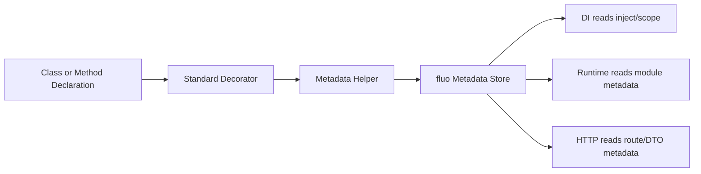

# 6장. 표준 데코레이터와 메타데이터

> **기준 소스**: [repo:docs/concepts/decorators-and-metadata.md] [pkg:core/README.md]
> **주요 구현 앵커**: [pkg:core/src/decorators.ts] [pkg:core/src/metadata.ts]

이 장은 fluo의 심장에 가까운 내용을 다룬다. fluo에서 `core`는 단순한 유틸리티 모음이 아니라, **프레임워크가 이해할 수 있는 선언을 코드에 새기는 층**이다.

## 이 장이 중요한 이유

독자는 보통 DI나 HTTP가 더 흥미롭다고 느낀다. 하지만 실제로는 이 장을 제대로 이해하지 못하면 이후 장은 전부 “프레임워크가 뭔가 알아서 해 주는 것”처럼 보이기 쉽다. fluo의 많은 기능은 `core`에서 시작된 메타데이터 위에 서 있기 때문이다 `[pkg:core/README.md]`.

## fluo에서 데코레이터는 무엇을 하는가

fluo의 데코레이터는 오래된 TypeScript 방식의 “숨겨진 메타데이터 생성 장치”가 아니다. fluo는 TC39 표준 데코레이터를 사용하고, 필요한 메타데이터를 프레임워크가 직접 관리하는 registry에 기록한다 `[repo:docs/concepts/decorators-and-metadata.md]`.

이 차이는 매우 크다.

- 프레임워크가 타입을 추측하지 않는다.
- 메타데이터 저장 형식이 프레임워크 내부에서 통제된다.
- 런타임과 빌드 도구에 덜 종속적이다.

<!-- diagram-source: repo:docs/concepts/decorators-and-metadata.md, pkg:core/src/decorators.ts, pkg:core/src/metadata/class-di.ts -->


이 도표는 fluo의 decorator layer가 왜 “즉시 실행”이 아니라 “기록 후 소비” 구조인지 한눈에 보여 준다. 중요한 점은 decorator가 곧바로 인스턴스를 만들거나 라우트를 열지 않고, **metadata store를 중심으로 sibling package들이 나중에 읽는 구조**를 만든다는 것이다 `[repo:docs/concepts/decorators-and-metadata.md]` `[pkg:core/src/decorators.ts]` `[pkg:core/src/metadata/class-di.ts]`.

## 실제 `decorators.ts`를 보면

`packages/core/src/decorators.ts`를 읽으면, `@Module`, `@Global`, `@Inject`, `@Scope`는 놀랄 만큼 단순하다 `[pkg:core/src/decorators.ts]`.

- `@Module(...)`는 `defineModuleMetadata(...)`를 호출한다.
- `@Global()`은 module metadata에 `global: true`를 기록한다.
- `@Inject(...)`는 클래스의 주입 토큰 목록을 기록한다.
- `@Scope(...)`는 provider lifecycle을 기록한다.

즉, 이 시점의 핵심은 **행동이 아니라 선언**이다.

## `decorators.ts`를 실제로 읽어보면

`packages/core/src/decorators.ts`는 의외로 짧다 `[pkg:core/src/decorators.ts]`. 하지만 바로 그 단순함이 중요하다.

```ts
// source: packages/core/src/decorators.ts (전체 파일, 61줄)
import {
  defineClassDiMetadata,
  defineModuleMetadata,
  type ClassDiMetadata,
  type ModuleMetadata,
} from './metadata.js';
import type { Token } from './types.js';

type StandardClassDecoratorFn = (value: Function, context: ClassDecoratorContext) => void;

export function Module(definition: ModuleMetadata): StandardClassDecoratorFn {
  return (target) => {
    defineModuleMetadata(target, definition);
  };
}

export function Global(): StandardClassDecoratorFn {
  return (target) => {
    defineModuleMetadata(target, { global: true });
  };
}

export function Inject(tokens: readonly Token[]): StandardClassDecoratorFn {
  return (target) => {
    defineClassDiMetadata(target, { inject: [...tokens] });
  };
}

export function Scope(scope: NonNullable<ClassDiMetadata['scope']>): StandardClassDecoratorFn {
  return (target) => {
    defineClassDiMetadata(target, { scope });
  };
}
```

이 파일은 전체가 61줄이다. 네 개의 데코레이터(`Module`, `Global`, `Inject`, `Scope`)가 전부이고, 모두 같은 패턴을 따른다. metadata helper를 호출하고, 그것으로 끝이다. `Module`도, `Inject`도, 직접적으로 module graph를 만들지 않고, 인스턴스를 생성하지도 않는다. 이것이 fluo의 중요한 미학이다. **decorator는 기록만 하고, 해석은 나중 계층으로 미룬다.**

## 메타데이터는 어디에 모이는가

`packages/core/src/metadata.ts`는 여러 종류의 메타데이터 reader/writer를 다시 내보내는 진입점 역할을 한다 `[pkg:core/src/metadata.ts]`. 여기서 중요한 점은 fluo가 메타데이터를 흩어진 방식으로 다루지 않는다는 것이다.

- module metadata
- controller / route metadata
- injection metadata
- validation metadata

이 모두가 프레임워크가 관리하는 metadata 계층으로 묶인다. 그래서 이후 `di`, `http`, `runtime`은 같은 메타데이터 모델을 공유할 수 있다 `[pkg:core/README.md]`.

## `class-di.ts`가 보여 주는 중요한 사실

`packages/core/src/metadata/class-di.ts`는 `@Inject`와 `@Scope`가 실제로 무엇을 남기는지를 아주 선명하게 보여 준다 `[pkg:core/src/metadata/class-di.ts]`.

```ts
// source: pkg:core/src/metadata/class-di.ts  (L27-37, L62-64)
export function defineClassDiMetadata(target: Function, metadata: ClassDiMetadata): void {
  const existing = classDiMetadataStore.read(target);

  classDiMetadataStore.write(
    target,
    {
      inject: metadata.inject !== undefined ? metadata.inject : existing?.inject,
      scope: metadata.scope ?? existing?.scope,
    },
  );
}

export function getClassDiMetadata(target: Function): ClassDiMetadata | undefined {
  return getInheritedClassDiMetadata(target);
}
```

이 코드는 fluo의 메타데이터 철학을 아주 압축적으로 보여 준다. 첫째, metadata write는 덮어쓰기만 하지 않고 기존 값을 보존하는 merge 성격을 가진다. `read()`로 기존 값을 꺼내고 `write()`로 합친 결과를 저장하는 2단계 패턴이 핵심이다. 둘째, metadata read는 단순 현재 클래스 조회가 아니라 **상속을 반영한 effective metadata 조회**다 `[pkg:core/src/metadata/class-di.ts]`.

이 점은 책에서 반드시 강조해야 한다. 왜냐하면 독자가 `@Inject`와 `@Scope`를 “클래스에 스티커 하나 붙이는 정도”로 오해하기 쉽기 때문이다. 실제로는 framework가 이후 `di` 단계에서 읽을 수 있는 **구조화된 상태**를 만들어 두는 셈이다.

- `defineClassDiMetadata(...)`는 기존 값을 보존하면서 새 값을 합친다.
- `getOwnClassDiMetadata(...)`는 현재 클래스에 직접 정의된 값만 읽는다.
- `getInheritedClassDiMetadata(...)`는 base → leaf 순으로 상속 체인을 따라가며 유효 metadata를 계산한다.

이 설계는 중요하다. fluo는 metadata를 한 번 적고 끝내는 단순 키-값 저장소가 아니라, **상속과 split decorator pass를 고려한 구조**로 다룬다.

## `shared.ts`는 왜 메인테이너에게 중요할까

`packages/core/src/metadata/shared.ts`는 표면적으로는 utility처럼 보이지만, 실제로는 fluo metadata 시스템의 공용 기반이다 `[pkg:core/src/metadata/shared.ts]`.

```ts
// source: pkg:core/src/metadata/shared.ts
export function ensureMetadataSymbol(): symbol {
  if (symbolWithMetadata.metadata) {
    metadataSymbol = symbolWithMetadata.metadata;
    return metadataSymbol;
  }

  Object.defineProperty(Symbol, 'metadata', {
    configurable: true,
    value: metadataSymbol,
  });

  return metadataSymbol;
}
```

이 짧은 코드가 말해 주는 것은 분명하다. fluo는 표준 메타데이터 접근점인 `Symbol.metadata`를 프레임워크 차원에서 명시적으로 보장한다 `[pkg:core/src/metadata/shared.ts#L20-L34]`. 즉, 메타데이터 접근 경로 자체가 우연한 구현 세부사항으로 남아 있지 않다.

```ts
// source: pkg:core/src/metadata/shared.ts
export const metadataKeys = {
  module: Symbol.for('fluo.metadata.module'),
  controller: Symbol.for('fluo.metadata.controller'),
  route: Symbol.for('fluo.metadata.route'),
  dtoFieldBinding: Symbol.for('fluo.metadata.dto-field-binding'),
  dtoFieldValidation: Symbol.for('fluo.metadata.dto-field-validation'),
  injection: Symbol.for('fluo.metadata.injection'),
  classDi: Symbol.for('fluo.metadata.class-di'),
  classValidation: Symbol.for('fluo.metadata.class-validation'),
} as const;
```

이 심볼 집합은 fluo 내부에서 메타데이터가 단순 문자열 키가 아니라 **명시적 namespace를 가진 계약 집합**임을 보여 준다 `[pkg:core/src/metadata/shared.ts#L75-L84]`. 메인테이너 관점에서는 바로 이 지점이 중요하다. 패키지가 늘어나도 어떤 metadata가 어떤 용도인지 namespace 차원에서 안정적으로 구분되기 때문이다.

여기서 특히 중요한 지점은 다음과 같다.

- `ensureMetadataSymbol()`은 `Symbol.metadata`를 표준 메타데이터 접근점으로 보장한다 `[pkg:core/src/metadata/shared.ts#L20-L34]`
- `metadataKeys`와 `standardMetadataKeys`는 framework-owned metadata namespace를 구분한다 `[pkg:core/src/metadata/shared.ts#L63-L84]`
- `cloneMutableValue(...)`, `cloneCollection(...)`, `mergeUnique(...)`는 metadata read/write를 방어적으로 유지한다 `[pkg:core/src/metadata/shared.ts#L52-L58]` `[pkg:core/src/metadata/shared.ts#L92-L143]`

이 함수들이 말해 주는 것은 단순하다. fluo는 metadata를 “있으면 읽는 값”으로 두지 않고, **방어적으로 복제하고 merge 규칙을 명시한 상태 데이터**로 다룬다.

## JavaScript 중급자 관점에서의 핵심 오해

중급자는 종종 `@Inject`를 보며 “아, 여기서 주입이 일어나는구나”라고 생각한다. 하지만 실제로는 아니다. `@Inject`는 **주입 정보를 기록**할 뿐이다 `[pkg:core/src/decorators.ts]`. 진짜 해석과 인스턴스 생성은 다음 장에서 보는 `Container`가 맡는다 `[pkg:di/src/container.ts]`.

이 구분을 잡는 순간 fluo 구조가 훨씬 맑아진다.

- core는 “무엇을 원한다”를 적는다.
- di는 “그것을 어떻게 준다”를 계산한다.

이 구분이 없으면 개발자는 항상 두 가지를 혼동하게 된다. “내가 뭘 선언했는가?”와 “프레임워크가 어떻게 그것을 실행하는가?”가 섞이는 순간, 디버깅도, 문서화도, 테스트도 모두 어려워진다.

## 왜 이 분리가 중요한가

이 구조는 프레임워크 내부 패키지들이 같은 메타데이터를 서로 다른 방식으로 읽을 수 있게 한다. 예를 들어 runtime은 module metadata를 읽어 앱 구조를 만들고 `[pkg:runtime/README.md]`, http는 route metadata를 읽어 핸들러를 만들며 `[pkg:http/README.md]`, di는 inject metadata를 읽어 생성자 의존성을 해석한다 `[pkg:di/src/container.ts]`.

즉, 메타데이터는 fluo 내부에서 **공통 언어** 역할을 한다.

## 이 장의 핵심 문장

> fluo의 데코레이터는 일을 직접 처리하는 도구가 아니라, **다른 패키지들이 공통으로 읽을 수 있는 계약을 기록하는 도구**다.

## 심화 워크스루 1: 왜 `decorators.ts`가 이렇게 짧아야 하는가

초심자는 종종 이런 질문을 한다. “왜 `@Inject` 안에서 바로 뭔가 더 많은 일을 하지 않지?” 하지만 바로 그 점이 중요하다. `decorators.ts`가 짧다는 것은 fluo가 decorator layer를 **부작용이 적은 선언 계층**으로 유지하려 한다는 뜻이다 `[pkg:core/src/decorators.ts]`.

만약 여기서 module graph를 계산하거나 container를 건드리기 시작하면 어떤 문제가 생길까?

- decorator 실행 시점과 bootstrap 실행 시점이 섞인다.
- 테스트에서 선언 계층을 독립적으로 검증하기 어려워진다.
- runtime, di, http가 같은 정보를 다른 방식으로 읽어야 할 때 중복 로직이 생긴다.

즉, `decorators.ts`가 짧다는 사실은 단순 구현 취향이 아니라, **패키지 간 책임 분리를 위한 구조적 선택**이다.

## 심화 워크스루 2: `defineClassDiMetadata(...)`는 왜 merge인가

`class-di.ts`에서 가장 중요한 건 `defineClassDiMetadata(...)`가 단순 set이 아니라 update 기반 merge라는 점이다 `[pkg:core/src/metadata/class-di.ts#L33-L38]`.

```ts
// source: pkg:core/src/metadata/class-di.ts  (L27-37)
export function defineClassDiMetadata(target: Function, metadata: ClassDiMetadata): void {
  const existing = classDiMetadataStore.read(target);

  classDiMetadataStore.write(
    target,
    {
      inject: metadata.inject !== undefined ? metadata.inject : existing?.inject,
      scope: metadata.scope ?? existing?.scope,
    },
  );
}
```

이 구현은 작은 것 같지만 실제로는 많은 뜻을 담고 있다.

1. decorator pass가 여러 번 나뉘어도 metadata를 잃지 않는다.
2. `inject`와 `scope`를 각각 독립적으로 보존할 수 있다.
3. 나중에 다른 metadata writer가 같은 target에 접근해도 형태가 안정적이다.

여기서 독자가 잡아야 하는 감각은 “메타데이터를 적는다”가 아니라, **프레임워크가 이후 읽을 수 있는 누적 상태를 만든다**는 것이다.

## 심화 워크스루 3: 상속은 왜 `base → leaf`로 읽는가

`getInheritedClassDiMetadata(...)`는 constructor lineage를 base에서 leaf로 따라가며 effective metadata를 만든다 `[pkg:core/src/metadata/class-di.ts#L56-L73]`.

이 선택은 매우 중요하다. 만약 leaf에서 base로 읽으면 override와 fallback 규칙이 뒤틀리기 쉽다. 반대로 base → leaf 순서로 읽으면, 상위 클래스의 기본값 위에 하위 클래스의 구체화가 덧씌워지는 자연스러운 모델이 만들어진다.

이 구조는 나중에 DI container가 `getClassDiMetadata(...)`를 통해 “이 클래스에서 실제로 보이는 inject/scope는 무엇인가?”를 안정적으로 읽게 해 준다 `[pkg:core/src/metadata/class-di.ts]` `[pkg:di/src/container.ts]`.

## 심화 워크스루 4: `shared.ts`가 사실상 core의 안전장치인 이유

`shared.ts` 안의 `cloneMutableValue(...)`, `cloneCollection(...)`, `mergeUnique(...)`는 단순 유틸처럼 보이지만, 사실상 metadata system 전체의 안전장치다 `[pkg:core/src/metadata/shared.ts#L52-L58]` `[pkg:core/src/metadata/shared.ts#L92-L143]`.

왜 안전장치일까?

- metadata를 읽어 간 쪽이 실수로 원본을 변형하지 못하게 막는다.
- collection merge 순서를 일관되게 유지한다.
- sibling package들이 같은 metadata를 읽어도 서로 관찰 결과가 크게 흔들리지 않는다.

즉, fluo는 metadata를 “있으면 읽고 없으면 넘어가는 느슨한 데이터”로 다루지 않는다. 오히려 **프레임워크 전 패키지가 공유하는 준-불변 계약 데이터**처럼 다룬다.

## `Global()`과 `Scope()`가 짧다고 가벼운 것은 아니다

`decorators.ts`를 보면 `Global()`과 `Scope()`도 매우 짧다 `[pkg:core/src/decorators.ts]`.

```ts
// source: pkg:core/src/decorators.ts
export function Global(): StandardClassDecoratorFn {
  return (target) => {
    defineModuleMetadata(target, { global: true });
  };
}

export function Scope(scope: NonNullable<ClassDiMetadata['scope']>): StandardClassDecoratorFn {
  return (target) => {
    defineClassDiMetadata(target, { scope });
  };
}
```

이 두 함수가 짧다는 사실은 오히려 중요하다. `Global()`은 module visibility라는 매우 큰 효과를 만들지만, 그 효과 자체는 runtime/module-graph 단계에서 읽혀야 한다. `Scope()`도 마찬가지로 provider lifecycle에 큰 영향을 주지만, 실제 해석은 DI container가 맡는다. 즉, **효과가 크다고 해서 decorator가 더 많은 일을 해야 하는 것은 아니다**. fluo는 끝까지 “decorator는 기록만 한다”는 규칙을 지킨다.

## 오버로드 시그니처가 보여 주는 의도

`Inject`는 내부 구현보다 오버로드 시그니처도 흥미롭다 `[pkg:core/src/decorators.ts#L42-L45]`.

```ts
// source: pkg:core/src/decorators.ts
export function Inject<const TTokens extends readonly Token[]>(
  tokens: TupleOnly<TTokens>,
): StandardClassDecoratorFn;
export function Inject(tokens: readonly Token[]): StandardClassDecoratorFn {
  return (target) => {
    defineClassDiMetadata(target, { inject: [...tokens] });
  };
}
```

여기서 `TupleOnly<TTokens>`는 단순 타입 장식이 아니다. fluo가 `@Inject(...)`를 “아무 값이나 여러 개 넣는 곳”이 아니라, **생성자 파라미터 순서와 대응되는 고정 토큰 목록**으로 다루고 싶어 한다는 의도가 드러난다. 즉, decorator layer에서도 이미 “명시성”이 타입 수준으로 강화되고 있다.

## metadata key 체계는 왜 이중 구조인가

`shared.ts`에는 `standardMetadataKeys`와 `metadataKeys`가 둘 다 있다 `[pkg:core/src/metadata/shared.ts#L63-L84]`. 이 이중 구조는 처음 보면 중복처럼 느껴질 수 있다. 하지만 실제로는 다르다.

- `standardMetadataKeys`는 TC39 표준 metadata bag과 연결되는 키 집합이다.
- `metadataKeys`는 fluo가 직접 소유하고 관리하는 저장소 키 집합이다.

이 구분은 중요하다. 프레임워크가 표준 데코레이터 세계와 연결되면서도, 내부 contract를 느슨하게 흩뿌리지 않고 자기 namespace 안에 보존하기 때문이다. 즉, fluo는 **표준과 내부 계약을 동시에 관리하는 이중 채널**을 갖는다.

## 이 장의 디버깅 체크리스트

6장을 읽고 나면 독자는 적어도 다음 순서로 문제를 좁혀 갈 수 있어야 한다.

1. 이 decorator가 실제로 metadata helper를 호출하는가? `[pkg:core/src/decorators.ts]`
2. metadata는 class/module/route 어느 저장소에 기록되는가? `[pkg:core/src/metadata.ts]`
3. 상속 시 effective metadata는 어떻게 계산되는가? `[pkg:core/src/metadata/class-di.ts]`
4. 다른 패키지가 이 metadata를 읽을 때 clone/merge 안전성은 어떻게 확보되는가? `[pkg:core/src/metadata/shared.ts]`

이 체크리스트가 가능해지는 순간, core는 더 이상 “기초 패키지”가 아니라 **프레임워크 전체 계약을 기록하는 원시층**으로 보이기 시작한다.

## `store.ts`가 보여 주는 clone-on-read/write 철학

앞에서 `class-di.ts`와 `shared.ts`를 봤다면, 이제 `metadata/store.ts`도 함께 봐야 한다 `[pkg:core/src/metadata/store.ts]`. 이 파일은 작지만 fluo metadata 계층의 핵심 철학을 아주 노골적으로 드러낸다.

```ts
// source: pkg:core/src/metadata/store.ts
export interface ClonedWeakMapStore<TKey extends object, TValue> {
  read(target: TKey): TValue | undefined;
  update(target: TKey, updateValue: (current: TValue | undefined) => TValue): void;
  write(target: TKey, value: TValue): void;
}

export function createClonedWeakMapStore<TKey extends object, TValue>(
  cloneValue: (value: TValue) => TValue,
): ClonedWeakMapStore<TKey, TValue> {
  const store = new WeakMap<TKey, TValue>();

  return {
    read(target: TKey): TValue | undefined {
      const value = store.get(target);
      return value !== undefined ? cloneValue(value) : undefined;
    },
    update(target: TKey, updateValue: (current: TValue | undefined) => TValue): void {
      store.set(target, cloneValue(updateValue(store.get(target))));
    },
    write(target: TKey, value: TValue): void {
      store.set(target, cloneValue(value));
    },
  };
}
```

이 구현은 매우 중요하다 `[pkg:core/src/metadata/store.ts]`. fluo는 metadata store를 단순 WeakMap으로 쓰지 않고, **read와 write 양쪽에서 clone을 강제하는 계약**으로 감싼다. 즉, 값을 읽는 쪽도 원본을 훼손할 수 없고, 값을 쓰는 쪽도 외부 참조를 그대로 저장하지 못한다.

이 철학은 앞에서 본 `shared.ts`와 정확히 맞물린다. fluo는 metadata를 “가변 객체를 여기저기 넘기며 공유하는 상태”가 아니라, clone-on-read/write를 거친 **방어적 계약 데이터**로 취급한다.

## 왜 WeakMap이어야 하는가

메타데이터 저장소가 WeakMap을 사용하는 것도 우연이 아니다. metadata의 주 대상이 class/function/object key이기 때문이다. WeakMap을 쓰면 metadata가 대상과 수명주기를 어느 정도 함께 가져갈 수 있고, 일반 Map보다 메모리 관리 측면에서도 더 안전한 기본값을 가질 수 있다 `[pkg:core/src/metadata/store.ts]`.

즉, core 장은 decorator 문법만 설명해서는 안 된다. 실제로는 **기록 대상, 저장 매체, clone 규칙, 상속 해석**까지 합쳐져야 비로소 fluo metadata 시스템이 보인다.

## 6장을 읽는 올바른 자세

이 장은 독자에게 약간 낯설 수 있다. controller나 service처럼 바로 눈에 보이는 기능이 아니라, 그 뒤에 깔린 metadata contract를 설명하기 때문이다. 하지만 바로 이 낯섦이 중요하다. 많은 프레임워크 사용서는 눈에 보이는 API만 설명하고, 그 API를 가능하게 만드는 기록 계층은 거의 다루지 않는다.

fluo 책이 여기서 차별화되어야 하는 이유는 분명하다. fluo의 강점은 표면 API가 아니라, **그 표면 API가 어떤 metadata contract 위에 서 있는지까지 추적 가능하다는 점**이기 때문이다.

즉, 6장은 “지루한 내부 구현”이 아니라, 뒤 장들의 설명력을 지탱하는 **책의 기반 암반**이다.

## 이 장을 이해한 독자가 얻게 되는 능력

6장을 제대로 이해하면, 독자는 이후 장을 읽을 때 항상 같은 질문을 할 수 있게 된다.

- 이 decorator는 실제로 어떤 metadata를 기록하는가?
- 그 metadata는 어느 store에 놓이는가?
- clone과 merge 규칙은 무엇인가?
- 어떤 패키지가 이 metadata를 읽는가?

이 질문이 가능해지는 순간, fluo는 데코레이터 프레임워크가 아니라 **metadata를 중심으로 조립된 계약형 시스템**으로 보이기 시작한다.

## 6장의 마지막 문장

이 장을 끝내는 가장 좋은 문장은 아마 이럴 것이다.

> fluo의 핵심은 데코레이터 문법 그 자체가 아니라, **그 데코레이터가 남긴 기록을 다른 계층이 일관되게 읽을 수 있게 만드는 metadata contract**다.

그리고 바로 그 이유 때문에, 이 장은 뒤의 runtime, DI, HTTP 장을 읽기 위한 가장 중요한 전제 조건이 된다.

이 장이 단단할수록, 책 전체의 설명도 흔들리지 않는다.

## 이 장을 읽고 나면 가능해야 하는 것

이 장을 제대로 이해한 독자는 적어도 다음 질문에 답할 수 있어야 한다.

- `@Inject`는 실제로 무엇을 하는가?
- decorator가 직접 주입을 수행하지 않는 이유는 무엇인가?
- metadata read/write가 왜 defensive clone을 필요로 하는가?
- 왜 core가 runtime/di/http보다 먼저 이해되어야 하는가?

이 질문에 답할 수 있다면, 이후 DI와 HTTP 장에서 프레임워크 내부 동작을 “마법”이 아니라 “계약을 소비하는 다른 계층의 동작”으로 읽을 준비가 된 것이다.
