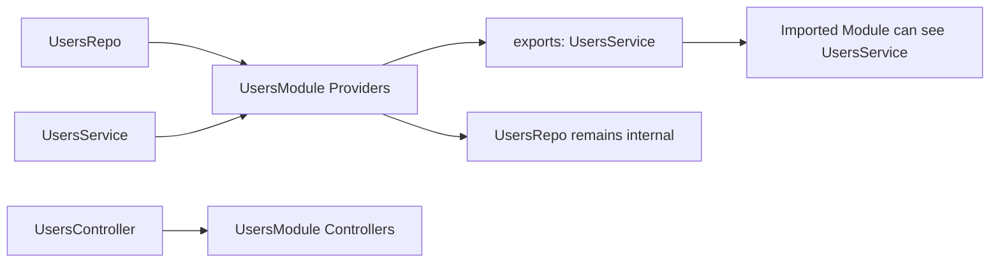

# 8장. 모듈 경계와 모듈 그래프

> **기준 소스**: [repo:docs/concepts/di-and-modules.md] [pkg:runtime/README.md]
> **주요 구현 앵커**: [ex:realworld-api/src/users/users.module.ts] [ex:minimal/src/app.ts]

이 장에서는 fluo가 왜 module을 단순 디렉터리 구분이 아니라 **가시성과 캡슐화의 경계**로 취급하는지 본다.

## 왜 이 장이 DI 다음에 와야 하는가

DI를 먼저 보고 module graph를 나중에 보는 순서는 우연이 아니다. 의존성 해석은 “무엇을 resolve할 수 있는가?”의 문제이고, module graph는 그 전에 “무엇이 보이는가?”를 결정한다 `[repo:docs/concepts/di-and-modules.md]`. 즉, graph는 resolve의 전제다.

## module은 왜 필요한가

fluo 문서는 module을 조직 도구가 아니라 boundary로 설명한다 `[repo:docs/concepts/di-and-modules.md]`. 즉, module의 핵심은 “파일을 예쁘게 정리한다”가 아니라 “무엇을 외부에 노출할지 통제한다”이다.

<!-- diagram-source: repo:docs/concepts/di-and-modules.md, pkg:runtime/src/module-graph.ts, ex:realworld-api/src/users/users.module.ts -->


이 도표는 `UsersModule` 예제가 왜 좋은지 보여 준다. 같은 기능 안에 있는 provider라도 모두가 외부에 보이는 것은 아니다. `exports`에 올라간 token만 다른 모듈에서 접근 가능하고, 나머지는 module 내부 구현으로 남는다 `[repo:docs/concepts/di-and-modules.md]` `[pkg:runtime/src/module-graph.ts]` `[ex:realworld-api/src/users/users.module.ts]`.

`UsersModule` 예제를 보면 구조가 단순하다 `[ex:realworld-api/src/users/users.module.ts]`.

```ts
// source: ex:realworld-api/src/users/users.module.ts
@Module({
  controllers: [UsersController],
  providers: [UsersRepo, UsersService],
  exports: [UsersService],
})
export class UsersModule {}
```

여기서 중요한 것은 `exports: [UsersService]`다. 이 한 줄이 외부 모듈이 무엇을 볼 수 있는지 결정한다.

이것은 단순 편의 설정이 아니라 fluo architecture의 가장 중요한 차단막 중 하나다. exports를 통해 드러나지 않은 provider는 module 내부 구현으로 남고, 외부는 그 내부에 직접 의존할 수 없다.

## imports / exports를 어떻게 읽어야 하나

초보자는 imports/exports를 “모듈 의존성 목록” 정도로 생각하기 쉽다. 하지만 중급자는 한 단계 더 들어가야 한다.

- `providers`는 이 모듈 내부에서 생성/관리되는 것
- `exports`는 외부에 보여 주는 것
- `imports`는 외부에서 가져오는 것

즉, module graph를 읽는다는 것은 **가시성 그래프를 읽는 것**이다.

## runtime은 이 graph를 실제로 컴파일한다

`packages/runtime/src/module-graph.ts`는 이 장의 가장 중요한 소스 중 하나다 `[pkg:runtime/src/module-graph.ts]`. 이 파일을 보면 module graph는 추상 도식이 아니라 실제 validation 알고리즘이다.

```ts
// source: pkg:runtime/src/module-graph.ts  (L173-197)
function compileModule(
  moduleType: ModuleType,
  runtimeProviderTokens: Set<Token>,
  compiled = new Map<ModuleType, CompiledModule>(),
  visiting = new Set<ModuleType>(),
  ordered: CompiledModule[] = [],
) {
  if (compiled.has(moduleType)) {
    const existing = compiled.get(moduleType);

    if (existing) {
      return existing;
    }
  }

  if (visiting.has(moduleType)) {
    throw new ModuleGraphError(
      `Circular module import detected for ${moduleType.name}.`,
      {
        module: moduleType.name,
        phase: 'module graph compilation',
        hint: 'Break the import cycle by extracting shared providers into a separate module that both sides can import independently.',
      },
    );
  }
```

이 발췌는 module graph가 선언을 예쁘게 정리해 두는 수준이 아니라, 실제로 **circular import를 검출하는 compilation 단계**임을 보여 준다 `[pkg:runtime/src/module-graph.ts#L173-L197]`. 즉, graph는 설명 도구가 아니라 bootstrap safety net이다.

- `compileModule(...)`는 imports를 따라가며 모듈을 수집한다 `[pkg:runtime/src/module-graph.ts#L173-L221]`
- circular import가 보이면 바로 `ModuleGraphError`를 던진다 `[pkg:runtime/src/module-graph.ts#L188-L197]`
- `validateProviderVisibility(...)`와 `validateControllerVisibility(...)`는 각 module에서 접근 가능한 token 집합을 기준으로 참조 유효성을 검사한다 `[pkg:runtime/src/module-graph.ts#L265-L319]`

즉, module graph는 나중에 “될 수도 있고 안 될 수도 있는” 구조가 아니라, bootstrap 시점에 실제로 검증되는 계약이다.

## 접근 가능성(accessibility)은 어떻게 계산되는가

module-graph 소스를 보면 accessible token set은 대략 네 묶음의 합이다 `[pkg:runtime/src/module-graph.ts#L251-L263]`.

```ts
// source: pkg:runtime/src/module-graph.ts
function createAccessibleTokenSet(
  runtimeProviderTokens: Set<Token>,
  moduleProviderTokens: Set<Token>,
  importedExportedTokens: Set<Token>,
  globalExportedTokens: Set<Token>,
): Set<Token> {
  return new Set<Token>([
    ...runtimeProviderTokens,
    ...moduleProviderTokens,
    ...importedExportedTokens,
    ...globalExportedTokens,
  ]);
}
```

이 짧은 코드가 module visibility의 핵심을 거의 다 설명한다 `[pkg:runtime/src/module-graph.ts#L251-L263]`. 어떤 token이 resolve 가능한가는 “등록됐는가?”의 문제가 아니라, **현재 module이 접근할 수 있는 집합 안에 있느냐**의 문제다.

이 때문에 fluo의 module graph 설명은 반드시 DI와 연결되어야 한다. DI는 resolve를 담당하지만, module graph는 그 resolve가 허용되는 범위를 먼저 정한다.

- runtime provider tokens
- 현재 module의 provider tokens
- imported module이 export한 tokens
- global module이 export한 tokens

이 설계는 왜 중요한가? 의존성 해석 문제가 단순히 “토큰이 등록됐나?”의 문제가 아니라, **현재 위치에서 그 토큰이 보여야 하느냐**의 문제이기 때문이다.

## imported module 해석은 어디서 이뤄지는가

module graph 소스를 더 보면 `resolveImportedModules(...)`가 imported module reference를 실제 compiled module record로 바꾸는 단계가 있다 `[pkg:runtime/src/module-graph.ts#L223-L243]`.

```ts
// source: pkg:runtime/src/module-graph.ts
function resolveImportedModules(
  compiledModule: CompiledModule,
  compiledByType: Map<ModuleType, CompiledModule>,
): CompiledModule[] {
  return (compiledModule.definition.imports ?? []).map((imported) => {
    const importedModule = compiledByType.get(imported);

    if (!importedModule) {
      throw new ModuleGraphError(
        `Imported module ${imported.name} was not compiled.`,
        {
          module: imported.name,
          phase: 'module graph validation',
          hint: `Ensure ${imported.name} is decorated with @Module() and included in the imports array of a compiled module.`,
        },
      );
    }

    return importedModule;
  });
}
```

이 함수는 얼핏 단순해 보여도 중요하다. imports 배열에 적힌 클래스가 정말로 compile path 안에 들어 있는지 여기서 확인되기 때문이다. 즉, module graph는 “문자열 이름으로 대충 연결하는” 구조가 아니라, **실제 모듈 타입과 compiled record를 대조하는 검증 구조**다.

## export validation은 왜 별도 단계인가

`createExportedTokenSet(...)`는 또 다른 중요한 단계다 `[pkg:runtime/src/module-graph.ts#L321-L345]`.

```ts
// source: pkg:runtime/src/module-graph.ts
function createExportedTokenSet(
  compiledModule: CompiledModule,
  importedExportedTokens: Set<Token>,
): Set<Token> {
  const exportedTokens = new Set<Token>();

  for (const token of compiledModule.definition.exports ?? []) {
    if (!compiledModule.providerTokens.has(token) && !importedExportedTokens.has(token)) {
      throw new ModuleVisibilityError(
        `Module ${compiledModule.type.name} cannot export token ${String(token)} because it is neither local nor re-exported from an imported module.`,
      );
    }

    exportedTokens.add(token);
  }

  return exportedTokens;
}
```

이 코드가 말해 주는 것은 단순하다. 아무 token이나 exports에 올릴 수 있는 것이 아니다. **직접 가진 token**이거나, **import한 module이 export한 token**만 다시 내보낼 수 있다 `[pkg:runtime/src/module-graph.ts#L321-L345]`. 즉, re-export도 규칙 안에서만 허용된다.

메인테이너 관점에서는 이 지점이 중요하다. export surface가 느슨해지면 module graph는 설계 문서가 아니라 혼란의 시작점이 되기 쉽기 때문이다.

## validateCompiledModules는 무엇을 끝내는가

`validateCompiledModules(...)`는 compile 이후의 진짜 마무리 단계다 `[pkg:runtime/src/module-graph.ts#L348-L395]`. 이 함수는 global exported token 집합을 모으고, 각 module에 대해 imported/exported/accessible token을 계산한 다음, provider visibility와 controller visibility를 검증한다.

즉, module graph chapter의 마지막 메시지는 이렇다.

> module graph는 단순 연결표가 아니라, **무엇이 보이고 무엇이 export 가능하며 무엇이 잘못된 의존성인지**를 bootstrap 시점에 끝까지 검증하는 계약 엔진이다.

## controller visibility까지 별도로 검사하는 이유

`validateControllerVisibility(...)`가 provider visibility와 별도로 존재하는 것도 의미가 있다 `[pkg:runtime/src/module-graph.ts#L293-L319]`. controller는 provider가 아니지만, 여전히 constructor dependency를 통해 토큰에 접근한다. 즉, fluo는 “controller는 어차피 HTTP 레이어니까 예외”라고 두지 않고, controller도 동일한 visibility contract 안으로 넣는다.

이 선택은 중요하다. 그래야 controller가 몰래 보이면 안 되는 내부 provider에 결합하는 일을 bootstrap 시점에 잡을 수 있다. 결국 module graph는 provider만이 아니라 **controller의 의존성 윤리**까지 강제한다.

## global module은 왜 조심해서 써야 하는가

module graph 소스를 보면 global module export는 `globalExportedTokens` 집합으로 따로 수집된다 `[pkg:runtime/src/module-graph.ts#L354-L367]`. 이 구조는 global module이 편의 기능이 아니라, **가시성 규칙을 넓혀 버리는 강한 도구**라는 사실을 보여 준다.

책에서는 global module을 단순 편의 패턴으로 소개하면 안 된다. 오히려 다음과 같이 설명하는 것이 맞다.

- 일반 import/export는 가장 좁은 가시성을 만든다.
- re-export는 통제된 공유를 만든다.
- global module은 가장 넓은 가시성을 만든다.

즉, global은 쓰기 쉬운 도구가 아니라 **아키텍처적 결정을 동반하는 확장 권한**이다.

## 왜 module graph 장이 CRUD 장보다 먼저여야 하는가

실전 예제를 먼저 읽고 싶은 마음은 자연스럽다. 하지만 이 장이 먼저 와야 CRUD 장을 제대로 읽을 수 있다. `UsersModule`이 왜 `UsersRepo`를 export하지 않고 `UsersService`만 export하는지, 왜 다른 모듈은 이 service만 보아야 하는지, 왜 import 관계가 runtime validation의 대상인지 모두 이 장에서 먼저 설명되기 때문이다.

즉, CRUD 장은 module graph 장의 응용이고, module graph 장은 CRUD 장의 구조적 전제다.

## 8장의 마지막 메시지

책에서 이 장이 전달해야 할 최종 메시지는 이렇다.

> 모듈 그래프는 폴더를 정리하는 개념이 아니라, **애플리케이션에서 누가 누구를 볼 수 있는가를 bootstrap 시점에 검증하는 실행 계약**이다.

## 왜 이 구조가 유지보수에 유리한가

명시적 exports는 내부 helper나 구현 세부사항이 다른 모듈로 번지는 것을 막는다 `[repo:docs/concepts/di-and-modules.md]`. 큰 프로젝트에서 이것은 매우 중요하다. 서비스 하나를 잘못 export하면 다른 모듈이 내부 구현에 결합하고, 나중에 구조 변경 비용이 커진다.

fluo는 기본적으로 이 결합을 억제하는 방향으로 설계되어 있다.

메인테이너는 바로 이 지점을 민감하게 본다. export를 늘리는 것은 단순 편의가 아니라, 패키지와 모듈의 public surface를 넓히는 행위이기 때문이다.

## runtime은 module graph를 어떻게 활용하는가

runtime README는 fluo가 module graph를 컴파일해 실행 가능한 application shell을 만든다고 설명한다 `[pkg:runtime/README.md]`. 즉, module graph는 단순 문서 정보가 아니라 실제 부팅 과정의 입력이다.

이 말은 곧, module graph 장이 architecture 설명에서 끝나면 안 된다는 뜻이기도 하다. 이 장은 “왜 imports/exports가 DI 이전에 중요해지는가”를 runtime 소스와 함께 보여줘야 한다.

이 점에서 module은 JavaScript의 import 문과는 역할이 다르다.

- 일반 import는 코드 실행을 위한 JS 문법이다.
- fluo module metadata는 프레임워크 구성 정보를 담는 선언이다.

## AppModule은 왜 특별한가

`examples/minimal/src/app.ts`의 `AppModule`은 root module 역할을 한다 `[ex:minimal/src/app.ts]`. root module은 전체 앱에서 어떤 기능 조각들을 가져오고 어떤 controller/provider를 활성화할지 결정하는 출발점이다. 즉, module graph에는 항상 “어디서부터 읽기 시작할지”를 알려 주는 루트가 필요하다.

## 이 장의 핵심

module은 단순한 분류 폴더가 아니다. fluo에서 module은 **provider visibility, feature boundary, runtime composition의 기준점**이다. 이 관점을 잡아야 이후 HTTP, auth, testing까지 모두 일관되게 이해된다.

짧게 말하면, module은 “파일을 묶는 장치”가 아니라 **무엇이 보이고 무엇이 숨겨질지를 결정하는 계약 계층**이다.
