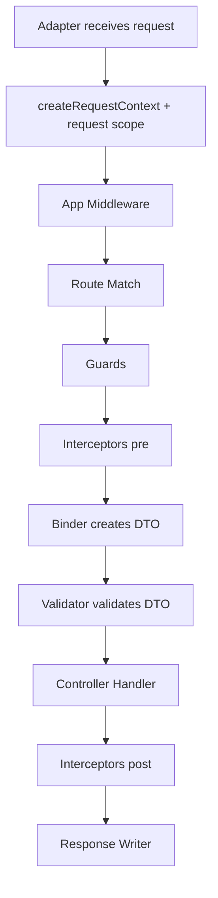

# 9장. HTTP 런타임과 DTO 흐름

> **기준 소스**: [repo:docs/concepts/http-runtime.md] [pkg:http/README.md]
> **주요 구현 앵커**: [ex:realworld-api/src/users/users.controller.ts] [pkg:http/README.md]

이 장에서는 fluo의 HTTP 실행 경로를 본다. 중요한 것은 controller 문법 자체보다, 요청이 들어와 응답이 나가기까지 어떤 단계가 순서대로 실행되는지 이해하는 것이다.

## 왜 이 장이 DI 다음이어야 하는가

HTTP는 겉으로 보기엔 controller와 route의 이야기 같지만, 실제로는 request마다 controller를 resolve하고, DTO를 bind하고, validation을 실행하고, guard/interceptor를 통과시키는 **복합 파이프라인**이다 `[pkg:http/src/dispatch/dispatcher.ts]` `[pkg:http/src/dispatch/dispatch-handler-policy.ts]`. 따라서 DI를 먼저 이해하지 못하면 HTTP chapter는 결국 “컨트롤러 문법 설명”으로 축소된다.

## HTTP는 “검은 상자”가 아니다

fluo 문서는 많은 프레임워크에서 request journey가 black box처럼 느껴진다고 지적한다 `[repo:docs/concepts/http-runtime.md]`. 그래서 fluo는 middleware, guard, interceptor, validation, serialization 순서를 명시적으로 설명한다.

이 점은 실무에서 매우 중요하다. 인증 로직을 guard에 둘지 interceptor에 둘지, 검증 오류가 어디서 터지는지, 응답 직렬화가 언제 일어나는지를 알 수 있어야 하기 때문이다.

<!-- diagram-source: repo:docs/concepts/http-runtime.md, pkg:http/src/dispatch/dispatcher.ts, pkg:http/src/dispatch/dispatch-handler-policy.ts, pkg:http/src/adapters/binding.ts -->


이 다이어그램은 장 전체의 척추다. fluo HTTP는 `Controller`에서 시작하지 않는다. adapter가 요청을 받고, request context와 request-scope container를 만들고, middleware/guard/interceptor/binder/validator를 차례로 거친 뒤에야 handler가 실행된다 `[repo:docs/concepts/http-runtime.md]` `[pkg:http/src/dispatch/dispatcher.ts]` `[pkg:http/src/dispatch/dispatch-handler-policy.ts]` `[pkg:http/src/adapters/binding.ts]`.

책에서는 여기서 단순 목록보다 “실제 dispatcher가 이 순서를 어떻게 orchestration하는가”를 보여주는 쪽으로 가야 한다.

## controller는 HTTP 세계의 입구다

realworld controller를 보면 fluo의 HTTP 스타일이 잘 드러난다 `[ex:realworld-api/src/users/users.controller.ts]`.

```ts
// source: ex:realworld-api/src/users/users.controller.ts
@Inject(UsersService)
@Controller('/users')
export class UsersController {
  constructor(private readonly service: UsersService) {}

  @Post('/')
  @RequestDto(CreateUserDto)
  create(dto: CreateUserDto): UserResponseDto {
    return this.service.createUser(dto.name, dto.email);
  }
}
```

이 코드에서 중요한 포인트는 두 가지다.

- `@Controller('/users')`는 라우팅 경계를 만든다.
- `@RequestDto(CreateUserDto)`는 요청 데이터를 DTO로 materialize하고 검증하는 경계를 만든다.

하지만 이 코드만 보면 여전히 많은 것이 생략되어 있다. 실제로는 다음 질문이 남는다.

- 누가 `UsersController` 인스턴스를 꺼내는가?
- 누가 `CreateUserDto`를 만든다?
- 검증 실패는 어디서 400으로 바뀌는가?
- interceptor는 handler 전후 어디서 실행되는가?

## DTO는 단순 타입 선언이 아니다

HTTP 문서와 package README를 함께 보면, fluo는 요청 body/query/path를 “신뢰되지 않은 raw input”으로 본다 `[repo:docs/concepts/http-runtime.md]` `[pkg:http/README.md]`. DTO는 이 raw input을 내부 타입 세계로 들여오는 첫 번째 관문이다.

그래서 DTO는 두 역할을 동시에 가진다.

1. 입력 모양을 정의한다.
2. 입력 검증의 기준이 된다.

즉, DTO는 개발 편의 문법이 아니라 **보안과 안정성의 경계**다.

## `dispatcher.ts`를 읽으면 파이프라인이 어떻게 보이는가

`packages/http/src/dispatch/dispatcher.ts`는 fluo HTTP runtime의 척추다 `[pkg:http/src/dispatch/dispatcher.ts]`. 이 파일은 한 요청이 들어왔을 때 어떤 순서로 어떤 하위 정책을 부를지 오케스트레이션한다.

```ts
// source: pkg:http/src/dispatch/dispatcher.ts
function createDispatchContext(
  request: FrameworkRequest,
  response: FrameworkResponse,
  rootContainer: Container,
): RequestContext {
  return createRequestContext({
    container: rootContainer.createRequestScope(),
    metadata: {},
    request,
    requestId: readRequestId(request),
    response,
  });
}
```

이 부분은 HTTP와 DI가 실제로 만나는 지점을 보여 준다. request가 들어오면 단순히 request/response만 전달되는 것이 아니라, **그 요청만을 위한 container scope**가 함께 생긴다 `[pkg:http/src/dispatch/dispatcher.ts#L60-L72]`. 이 때문에 request-scoped provider가 HTTP lifecycle 안에서 자연스럽게 동작할 수 있다.

특히 중요한 구간은 다음과 같다.

- `createDispatchContext(...)`가 request-scope container와 requestId를 포함한 context를 만든다 `[pkg:http/src/dispatch/dispatcher.ts#L60-L72]`
- `runDispatchPipeline(...)`이 app middleware → route match → module middleware → matched handler dispatch 순서로 흐른다 `[pkg:http/src/dispatch/dispatcher.ts#L218-L254]`
- `dispatchMatchedHandler(...)`는 guard chain, interceptor chain, handler invocation, success response, observer notification을 묶는다 `[pkg:http/src/dispatch/dispatcher.ts#L125-L168]`

그리고 실제 파이프라인 본문은 다음처럼 읽힌다.

```ts
// source: pkg:http/src/dispatch/dispatcher.ts  (L218-254)
async function runDispatchPipeline(context: DispatchPhaseContext): Promise<void> {
  ensureRequestNotAborted(context.requestContext.request);

  const appMiddlewareContext: MiddlewareContext = {
    request: context.requestContext.request,
    requestContext: context.requestContext,
    response: context.response,
  };

  await runMiddlewareChain(context.options.appMiddleware ?? [], appMiddlewareContext, async () => {
    if (context.response.committed) {
      return;
    }

    const match = matchHandlerOrThrow(context.options.handlerMapping, appMiddlewareContext.request);
    context.matchedHandler = match.descriptor;
    updateRequestParams(context.requestContext, match.params);
    await notifyHandlerMatched(context, match.descriptor);

    const moduleMiddlewareContext: MiddlewareContext = {
      request: context.requestContext.request,
      requestContext: context.requestContext,
      response: context.response,
    };

    await runMiddlewareChain(match.descriptor.metadata.moduleMiddleware ?? [], moduleMiddlewareContext, async () => {
      await dispatchMatchedHandler(
        match.descriptor,
        context.requestContext,
        context.observers,
        context.contentNegotiation,
        context.options.binder,
        context.options.interceptors,
      );
    });
  });
}
```

이 코드를 보면 fluo HTTP runtime은 거대한 monolith 함수가 아니라, app middleware chain → route match → module middleware chain → matched handler dispatch로 흐르는 **단계형 orchestration**이라는 점이 분명하다 `[pkg:http/src/dispatch/dispatcher.ts#L218-L254]`. 특히 app middleware와 module middleware가 **두 겹**으로 분리되어 있다는 점이 중요하다. 이는 전역 관심사(CORS, logging 등)와 모듈 수준 관심사(특정 기능 그룹의 전처리 등)를 구조적으로 나눌 수 있게 한다.

이 구조를 보면 HTTP runtime은 한 함수가 모든 일을 하는 구조가 아니라, **작은 정책 함수들을 묶는 dispatcher**라는 사실이 드러난다.

## route match는 생각보다 더 단순하고, 그래서 더 중요하다

`dispatch-routing-policy.ts`는 놀랄 만큼 짧다 `[pkg:http/src/dispatch/dispatch-routing-policy.ts]`.

```ts
// source: pkg:http/src/dispatch/dispatch-routing-policy.ts
export function matchHandlerOrThrow(handlerMapping: HandlerMapping, request: FrameworkRequest): HandlerMatch {
  const match = handlerMapping.match(request);

  if (!match) {
    throw new HandlerNotFoundError(`No handler registered for ${request.method} ${request.path}.`);
  }

  return match;
}

export function updateRequestParams(requestContext: RequestContext, params: Readonly<Record<string, string>>): void {
  requestContext.request = {
    ...requestContext.request,
    params,
  };
}
```

이 짧은 코드가 의미하는 것은 분명하다. route matching 자체는 복잡한 마법이 아니라, **handler mapping이 주어진 상태에서 일치하는 handler를 찾고, params를 현재 request context에 반영하는 단계**다 `[pkg:http/src/dispatch/dispatch-routing-policy.ts]`. 즉, 복잡성은 route match 자체가 아니라, 그 앞뒤에 붙는 guard/interceptor/binder/validator에 있다.

이 구분이 중요하다. 그래야 독자가 “왜 여기서 404가 나는가?”와 “왜 여기서 400이 나는가?”를 서로 다른 단계의 문제로 분리해 생각할 수 있다.

## controller invocation은 실제로 어떻게 일어나는가

`packages/http/src/dispatch/dispatch-handler-policy.ts`를 보면 controller invocation은 생각보다 직설적이다 `[pkg:http/src/dispatch/dispatch-handler-policy.ts]`.

```ts
// source: pkg:http/src/dispatch/dispatch-handler-policy.ts  (전체 파일, 37줄)
export async function invokeControllerHandler(
  handler: HandlerDescriptor,
  requestContext: RequestContext,
  binder: Binder = defaultBinder,
): Promise<unknown> {
  const controller = await requestContext.container.resolve(handler.controllerToken as Token<object>);
  const method = (controller as Record<string, unknown>)[handler.methodName];

  if (typeof method !== 'function') {
    throw new InvariantError(
      `Controller ${handler.controllerToken.name} does not expose handler method ${handler.methodName}.`,
    );
  }

  const argumentResolverContext: ArgumentResolverContext = {
    handler,
    requestContext,
  };
  const input = handler.route.request
    ? await binder.bind(handler.route.request, argumentResolverContext)
    : undefined;

  if (handler.route.request) {
    await defaultValidator.validate(input, handler.route.request);
  }

  return method.call(controller, input, requestContext);
}
```

이 발췌는 한 요청이 실제 handler 실행으로 가는 마지막 직선 구간을 보여 준다. 먼저 controller를 DI container에서 resolve하고, 다음으로 binder가 DTO를 만들고, validator가 검증하고, 마지막에야 method를 호출한다 `[pkg:http/src/dispatch/dispatch-handler-policy.ts]`. 즉, controller method는 HTTP 처리의 출발점이 아니라 거의 마지막 단계다.

## `DefaultBinder`가 실제로 무엇을 하는가

`packages/http/src/adapters/binding.ts`는 DTO binding을 실제로 수행하는 코드다 `[pkg:http/src/adapters/binding.ts]`.

```ts
// source: pkg:http/src/adapters/binding.ts
for (const entry of schema) {
  const rawValue = readSourceValue(
    context.requestContext.request,
    entry.metadata.source,
    entry.propertyKey,
    entry.metadata.key,
  );

  if (rawValue === undefined) {
    if (entry.metadata.optional) {
      continue;
    }

    details.push(
      toInputErrorDetail({
        code: 'MISSING_FIELD',
        field: toFieldName(entry.propertyKey),
        message: `Missing required ${entry.metadata.source} field ${resolveSourceKey(entry.propertyKey, entry.metadata.key)}.`,
        source: entry.metadata.source,
      }),
    );
    continue;
  }
```

이 부분은 DTO binding이 단순 값 복사가 아니라는 점을 잘 보여 준다. binder는 source 종류를 구분해 값을 읽고, optional 여부를 보고, required field가 없으면 에러 detail을 쌓는다 `[pkg:http/src/adapters/binding.ts#L180-L201]`. 즉, binding 단계부터 이미 **입력 표면을 엄격히 관리하는 정책**이 작동한다.

## 심화 워크스루 1: body는 왜 먼저 차단되는가

`binding.ts`는 body를 읽기 전에 plain object인지 검사하고, 위험한 키나 알 수 없는 필드를 차단한다 `[pkg:http/src/adapters/binding.ts#L49-L57]` `[pkg:http/src/adapters/binding.ts#L64-L96]`. 이 선택은 매우 중요하다.

- `__proto__`, `constructor`, `prototype` 같은 위험 키를 막는다.
- DTO schema에 없는 body field를 거부한다.
- body 자체가 plain object가 아니면 조기에 400으로 막는다.

즉, fluo의 binder는 단순 매핑 도구가 아니라 **입력 표면을 좁히는 방화벽**에 가깝다.

## 심화 워크스루 2: HTTP와 DI의 접합부는 어디인가

많은 독자는 controller를 HTTP 장의 시작점으로 생각한다. 하지만 실제로는 그렇지 않다. HTTP와 DI가 만나는 실제 지점은 `invokeControllerHandler(...)` 안에서 controller token을 request scope container로 resolve하는 부분이다 `[pkg:http/src/dispatch/dispatch-handler-policy.ts]`.

이것이 의미하는 바는 분명하다.

- controller도 결국 DI world의 객체다.
- HTTP는 controller를 직접 new 하지 않는다.
- request lifecycle은 container lifecycle과 연결된다.

따라서 fluo HTTP는 독립 엔진이 아니라, **DI contract를 실제 요청 흐름에 투영하는 엔진**이라고 보는 편이 맞다.

## 심화 워크스루 3: observer와 finish 단계가 말해 주는 것

`dispatcher.ts`를 자세히 보면 request start, handler matched, request error, request finish 시점마다 observer notification 훅이 있다 `[pkg:http/src/dispatch/dispatcher.ts#L179-L216]`. 이건 단순 장식 기능이 아니다. 프레임워크가 요청 lifecycle을 관찰 가능한 이벤트 흐름으로 보고 있다는 뜻이다.

그리고 `dispatch(...)`의 finally 블록에서는 request-scoped container를 dispose한다 `[pkg:http/src/dispatch/dispatcher.ts#L290-L304]`. 이 부분은 메인테이너 관점에서 특히 중요하다. 요청 처리가 끝난 뒤 scope 자원을 정리하지 않으면 request lifecycle은 구조적으로 완결되지 않는다.

## 심화 워크스루 4: 이 장의 디버깅 체크리스트

HTTP 처리 이상을 만났을 때는 다음 순서로 좁히는 것이 좋다.

1. route match가 정상적으로 되었는가? `[pkg:http/src/dispatch/dispatcher.ts]`
2. request context가 만들어졌는가? `[pkg:http/src/dispatch/dispatcher.ts#L60-L72]`
3. guard나 interceptor 중 먼저 실패한 것이 있는가? `[pkg:http/src/dispatch/dispatcher.ts#L142-L153]`
4. binder가 DTO 생성 단계에서 실패했는가? `[pkg:http/src/adapters/binding.ts]`
5. validation이 입력을 거부했는가? `[pkg:http/src/dispatch/dispatch-handler-policy.ts#L32-L35]`
6. response writing 이전에 에러 policy가 개입했는가? `[pkg:http/src/dispatch/dispatcher.ts#L256-L275]`

이 순서를 따라가면 HTTP 장애는 갑자기 복잡한 블랙박스가 아니라, **정해진 단계 중 어디선가 실패한 파이프라인**으로 보이기 시작한다.

1. request scope container에서 controller token을 resolve한다.
2. handler method가 실제 함수인지 확인한다.
3. binder로 request DTO를 만든다.
4. validator로 DTO를 검증한다.
5. method를 호출한다.

이 파일의 짧은 길이가 오히려 중요하다. 복잡성은 “여기서 무슨 마법을 하느냐”가 아니라, **각 단계가 어떤 계약에 기대고 있느냐**에 있다.

## 요청은 어떤 순서로 흐르는가

fluo의 설명을 압축하면 다음과 같다 `[repo:docs/concepts/http-runtime.md]`.

1. platform adapter가 요청을 받는다.
2. request context가 만들어진다.
3. route가 매칭된다.
4. guard가 실행된다.
5. interceptor pre-handler가 실행된다.
6. 입력이 DTO로 materialize되고 validation이 수행된다.
7. controller handler가 실행된다.
8. interceptor post-handler가 실행된다.
9. 응답이 serialize되어 최종 write된다.

이 순서는 문서 요약이기도 하지만, 실제 소스 구조와도 대응된다.

- route matching은 routing policy `[pkg:http/src/dispatch/dispatcher.ts]`
- binder와 DTO materialization은 binding adapter `[pkg:http/src/adapters/binding.ts]`
- validation은 handler policy 안의 validator 호출 `[pkg:http/src/dispatch/dispatch-handler-policy.ts]`
- 성공/실패 응답은 response policy `[pkg:http/src/dispatch/dispatcher.ts]`

이 순서를 이해하면 “왜 여기서 400이 나지?” 같은 질문에 답하기 쉬워진다.

## 왜 request context가 필요한가

HTTP package README는 active request를 함수 깊숙한 곳에서도 읽을 수 있게 하는 context 도구를 설명한다 `[pkg:http/README.md]`. 이는 인증 principal, requestId, observability 같은 교차 관심사를 핸들러 시그니처에 억지로 끼워 넣지 않게 해준다.

이 지점에서 HTTP와 DI는 다시 만난다. request context 안에는 request-scope container가 함께 들어 있기 때문이다 `[pkg:http/src/dispatch/dispatcher.ts#L60-L72]`. 그래서 HTTP 처리 도중 resolve되는 객체는 요청 단위 수명을 가질 수 있다.

## request context는 AsyncLocalStorage 위에 선다

request context의 구현은 `packages/http/src/context/request-context.ts`에서 볼 수 있다 `[pkg:http/src/context/request-context.ts]`.

```ts
// source: pkg:http/src/context/request-context.ts
const requestContextStore = new AsyncLocalStorage<RequestContext>();

export function runWithRequestContext<T>(context: RequestContext, callback: () => T): T {
  return requestContextStore.run(context, callback);
}

export function getCurrentRequestContext(): RequestContext | undefined {
  return requestContextStore.getStore();
}
```

이 발췌는 request context가 단순 인자 전달 패턴이 아니라, **현재 async execution chain에 바인딩된 상태**라는 점을 보여 준다 `[pkg:http/src/context/request-context.ts#L7-L27]`. 이 덕분에 handler 깊숙한 곳에서도 현재 request context를 읽을 수 있고, principal이나 requestId 같은 교차 관심사를 일관되게 접근할 수 있다.

이 구조를 이해하면 request context는 “편의 기능”이 아니라, **요청 단위 상태를 안전하게 전달하는 기반 계층**으로 보이기 시작한다.

## guard 체인은 어떻게 단순함을 유지하는가

`guards.ts`도 짧지만 의미가 크다 `[pkg:http/src/guards.ts]`.

```ts
// source: pkg:http/src/guards.ts
export async function runGuardChain(definitions: GuardLike[], context: GuardContext): Promise<void> {
  for (const definition of definitions) {
    const guard = await resolveGuard(definition, context.requestContext);
    const result = await guard.canActivate(context);

    if (result === false) {
      throw new ForbiddenException('Access denied.');
    }
  }
}
```

이 코드는 guard가 “첫 번째 false에서 중단되는 직렬 체인”이라는 사실을 명확히 보여 준다 `[pkg:http/src/guards.ts#L18-L27]`. 복잡한 policy engine이 아니라, request-scoped DI로 guard를 resolve한 뒤 순서대로 평가하는 구조다.

AuthGuard 같은 더 복잡한 guard도 결국은 이 단순한 체인 위에 올라간다. 즉, HTTP 장에서 auth를 설명할 때도 기반 구조는 여기다.

## interceptor는 왜 양파 구조처럼 동작하는가

`interceptors.ts`를 보면 interceptor chain은 reverse 순회로 구성된다 `[pkg:http/src/interceptors.ts]`.

```ts
// source: pkg:http/src/interceptors.ts
export async function runInterceptorChain(
  definitions: InterceptorLike[],
  context: InterceptorContext,
  terminal: () => Promise<unknown>,
): Promise<unknown> {
  let next: CallHandler = {
    handle: terminal,
  };

  for (const definition of [...definitions].reverse()) {
    const interceptor = await resolveInterceptor(definition, context.requestContext);
    const previous = next;

    next = {
      handle: () => Promise.resolve(interceptor.intercept(context, previous)),
    };
  }

  return next.handle();
}
```

이 구현은 interceptor를 “핸들러 전후에 끼어드는 훅”이 아니라, **terminal handler를 둘러싸는 nested call chain**으로 이해하게 해 준다 `[pkg:http/src/interceptors.ts#L26-L45]`. 이 때문에 pre-handler와 post-handler의 양쪽 역할을 같은 구조 안에서 자연스럽게 표현할 수 있다.

즉, guard는 직렬 필터에 가깝고, interceptor는 합성된 call wrapper에 가깝다. 책에서 이 둘의 차이를 분명히 해 주는 것이 중요하다.

## success response는 어디서 최종 결정되는가

응답 직렬화와 status code 결정은 `dispatch-response-policy.ts`가 담당한다 `[pkg:http/src/dispatch/dispatch-response-policy.ts]`.

```ts
// source: pkg:http/src/dispatch/dispatch-response-policy.ts
function resolveDefaultSuccessStatus(handler: HandlerDescriptor, value: unknown): number {
  switch (handler.route.method) {
    case 'POST':
      return 201;
    case 'DELETE':
    case 'OPTIONS':
      return value === undefined ? 204 : 200;
    default:
      return 200;
  }
}
```

이 작은 함수는 HTTP 장에서 상당히 중요하다 `[pkg:http/src/dispatch/dispatch-response-policy.ts#L13-L23]`. 왜 POST는 기본 201인지, DELETE는 언제 204인지 같은 규칙이 이 레벨에서 확정되기 때문이다. 즉, controller가 응답을 직접 작성하지 않아도 framework가 합리적인 HTTP default를 제공한다.

그리고 실제 write 단계는 다음처럼 이어진다.

```ts
// source: pkg:http/src/dispatch/dispatch-response-policy.ts
if (handler.route.successStatus !== undefined) {
  response.setStatus(handler.route.successStatus);
} else if (response.statusSet !== true) {
  response.setStatus(resolveDefaultSuccessStatus(handler, value));
}

const responseBody = formatter
  ? formatter.format(value)
  : value;
await response.send(responseBody);
```

이 흐름을 보면 response writing도 무작위가 아니다. route-level successStatus override가 먼저 오고, 없으면 default status를 계산하고, formatter가 있으면 직렬화한 뒤 send한다 `[pkg:http/src/dispatch/dispatch-response-policy.ts#L57-L67]`. 즉, response 역시 **정해진 정책 단계**를 따라 최종화된다.

## 이 장의 두 번째 핵심 문장

앞의 핵심 문장이 “HTTP는 route를 호출하는 시스템이 아니라 request를 안전하게 통과시키는 파이프라인”이었다면, 이 장의 두 번째 핵심 문장은 이렇다.

> fluo HTTP의 복잡성은 거대한 블랙박스에서 나오지 않는다. 오히려 **routing, context, guards, interceptors, binding, validation, response policy가 분리되어 있기 때문에** 추적 가능한 복잡성이 된다.

## 메인테이너 시각

메인테이너 관점에서 HTTP runtime은 가장 많은 교차 관심사가 만나는 층이다. 인증, validation, request context, 에러 응답, 직렬화, observability가 모두 이 지점에 걸쳐 있다. 따라서 이 장은 사용자 API 소개가 아니라, **프레임워크가 요청을 어떻게 안전하게 통제하는가**를 설명하는 장이어야 한다.

## 이 장의 핵심

fluo의 HTTP runtime은 controller 문법보다 **순서**가 중요하다. adapter에서 시작해 context, guard, interceptor, DTO validation, handler, serialization로 이어지는 이 순서를 이해해야 auth, observability, 에러 처리도 모두 제자리를 찾는다.

한 문장으로 요약하면, **fluo HTTP는 route를 호출하는 시스템이 아니라, request를 내부 세계에 안전하게 통과시키는 파이프라인**이다.
