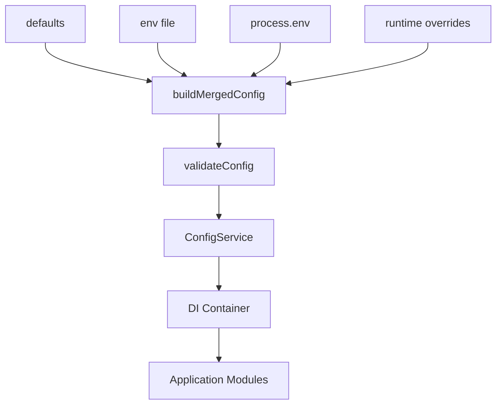

# 10장. 설정은 데이터다

> **기준 소스**: [repo:docs/concepts/config-and-environments.md] [pkg:config/README.md]
> **주요 구현 앵커**: [pkg:config/README.md] [pkg:config/src/load.ts] [pkg:config/src/module.ts] [pkg:config/src/service.ts] [ex:realworld-api/src/app.ts]

이 장은 fluo가 설정을 어떻게 바라보는지 설명한다. fluo는 환경 변수를 군데군데 읽는 습관을 지양하고, 설정을 **검증 가능한 런타임 데이터**로 취급한다 `[repo:docs/concepts/config-and-environments.md]`.

## 왜 이 장이 core/di/http 다음에 와야 하는가

설정은 보통 입문서에서 앞부분에 나오지만, fluo 책에서는 조금 뒤로 미루는 편이 자연스럽다. 이유는 간단하다. config는 독립 주제가 아니라 **bootstrap과 runtime boundary의 일부**이기 때문이다 `[pkg:config/README.md]`.

## 왜 `process.env`를 직접 읽지 않는가

config 문서는 ambient configuration의 문제를 분명히 지적한다 `[repo:docs/concepts/config-and-environments.md]`.

- 어떤 값이 필요한지 코드 전체를 읽어야 안다.
- 문자열 기반이라 타입 오류가 숨어든다.
- 테스트에서 전역 상태 오염이 생기기 쉽다.

그래서 fluo는 설정을 부트스트랩 단계에서 모으고, 검증하고, `ConfigService`를 통해 접근하게 만든다 `[pkg:config/README.md]`.

이 차이는 생각보다 크다. scattered `process.env` 접근에서는 설정이 코드 전체로 새어 나가지만, config module을 사용하면 설정은 하나의 module concern으로 수렴한다.

## config boundary란 무엇인가

config boundary는 "앱 외부 세계의 값이 앱 내부로 들어오는 유일한 문"이다. 파일, 환경 변수, 기본값, runtime override가 어떤 우선순위로 병합되는지도 문서화되어 있다 `[repo:docs/concepts/config-and-environments.md]` `[pkg:config/README.md]`.

<!-- diagram-source: repo:docs/concepts/config-and-environments.md, pkg:config/src/load.ts, pkg:config/src/module.ts -->


이 도표는 fluo config의 전체 흐름을 보여 준다. 외부에서 들어오는 여러 설정 소스는 먼저 병합되고, 그 다음 검증을 통과해야 하며, 마지막에야 `ConfigService`라는 읽기 전용 facade로 DI world 안에 들어간다 `[repo:docs/concepts/config-and-environments.md]` `[pkg:config/src/load.ts]` `[pkg:config/src/module.ts]`.

이 우선순위 설명은 책에서 단순 표로 끝내지 않는 편이 좋다. 실제로는 이것이 "운영 환경에서 무슨 값이 최종적으로 선택되는가"를 결정하기 때문이다.

실제 소스를 보면 이 병합과 검증이 어떻게 구현되는지 분명해진다 `[pkg:config/src/load.ts#L104-L128]`.

```ts
// source: pkg:config/src/load.ts  (L104-L128)
function buildMergedConfig(options: NormalizedLoadOptions): ConfigDictionary {
  const envFileValues = readEnvFileValues(options);

  return mergeConfigSources(
    options.defaults,
    envFileValues,
    options.safeProcessEnv,
    options.runtimeOverrides,
  );
}

function validateConfig(options: NormalizedLoadOptions, merged: ConfigDictionary): ConfigDictionary {
  try {
    return options.validate ? options.validate(merged) : merged;
  } catch (error: unknown) {
    throw new fluoError('Invalid configuration.', {
      code: 'INVALID_CONFIG',
      cause: error,
    });
  }
}

function resolveConfig(options: NormalizedLoadOptions): ConfigDictionary {
  return validateConfig(options, buildMergedConfig(options));
}
```

이 세 함수가 fluo config pipeline의 핵심이다. `buildMergedConfig`는 defaults → env file → process.env → runtime overrides 순으로 네 소스를 병합하고, `validateConfig`는 사용자가 등록한 검증 함수를 실행한다. 마지막으로 `resolveConfig`가 이 둘을 한 줄로 묶는다. 검증이 실패하면 `INVALID_CONFIG` 코드와 함께 즉시 에러가 난다. 즉, 잘못된 설정은 앱이 뜨기 전에 막힌다.

이 구조는 단순한 취향 문제가 아니다. 설정이 틀렸다면 앱이 **부팅에 실패해야 한다**는 fluo 철학과 직결된다.

이 원칙은 매우 중요하다. runtime 중간에야 잘못된 환경 변수를 발견하는 시스템보다, bootstrap 단계에서 명확히 실패하는 시스템이 운영 비용이 낮다. 이 장은 바로 그 "조기 실패의 가치"를 독자에게 설득해야 한다.

## `ConfigModule.forRoot`는 이 모든 것을 DI world로 연결한다

config가 단독으로 동작하면 의미가 반감된다. `ConfigModule.forRoot(...)`는 config loading 결과를 fluo DI container에 등록하는 접합부다 `[pkg:config/src/module.ts]`.

```ts
// source: pkg:config/src/module.ts  (전체 파일, 46줄)
export class ConfigModule {
  static forRoot(options?: ConfigModuleOptions): new () => ConfigModule {
    class ConfigModuleImpl extends ConfigModule {}

    defineModuleMetadata(ConfigModuleImpl, {
      global: options?.isGlobal ?? true,
      exports: [ConfigService],
      providers: [
        {
          provide: ConfigService,
          useFactory: () => new ConfigService(loadConfig(options ?? {})),
        },
      ],
    });

    return ConfigModuleImpl;
  }
}
```

이 코드가 보여 주는 것은 분명하다. `forRoot`는 동적 모듈 클래스를 하나 만들고, 그 안에 `ConfigService`를 factory provider로 등록한다. `loadConfig`가 호출되는 시점은 provider factory가 실행되는 시점, 즉 bootstrap이다. 그리고 `global: true`가 기본이므로 앱 어디서든 `ConfigService`에 접근할 수 있다 `[pkg:config/src/module.ts]`.

이 패턴은 7장에서 본 factory provider, 8장에서 본 global module이 실전에서 어떻게 합류하는지를 보여 주는 좋은 예시이기도 하다.

## `ConfigService`는 설정에 타입 안전한 접근을 제공한다

`ConfigService` 클래스는 읽기 전용 facade다. 내부에 config snapshot을 deep clone해서 보관하고, dot-path key로 접근할 수 있게 한다 `[pkg:config/src/service.ts]`.

```ts
// source: pkg:config/src/service.ts  (L13-L78)
export class ConfigService<T extends Record<string, unknown> = ConfigDictionary> {
  private values: T;

  constructor(values: T) {
    this.values = cloneConfigDictionary(values);
  }

  get<K extends DotPaths<T>>(key: K): DotValue<T, K & string> | undefined {
    return this._resolve(key as string) as DotValue<T, K & string> | undefined;
  }

  getOrThrow<K extends DotPaths<T>>(key: K): DotValue<T, K & string> {
    const value = this._resolve(key as string);

    if (value === undefined) {
      throw new fluoError(`Missing config key: ${String(key)}`, { code: 'CONFIG_KEY_MISSING' });
    }

    return value as DotValue<T, K & string>;
  }

  snapshot(): ConfigDictionary {
    return cloneConfigDictionary(this.values);
  }

  private _resolve(key: string): unknown {
    let resolved: unknown;

    if (hasOwn(this.values, key)) {
      resolved = this.values[key];
    } else {
      const parts = key.split('.');
      let current: unknown = this.values;
      for (const part of parts) {
        if (!hasOwn(current, part)) {
          return undefined;
        }
        current = current[part];
      }
      resolved = current;
    }

    if (typeof resolved === 'object' && resolved !== null) {
      return cloneConfigDictionary(resolved);
    }

    return resolved;
  }
}
```

여기서 주목할 점은 세 가지다.

- `get()`은 없으면 `undefined`를 돌려주고, `getOrThrow()`는 `CONFIG_KEY_MISSING` 에러를 던진다. 즉, 선택적 설정과 필수 설정을 호출 시점에서 구분한다.
- `_resolve()`는 flat key 먼저 시도하고, 없으면 dot-path를 분해해 중첩 객체를 순회한다.
- 반환값이 객체이면 deep clone을 한다. 이는 config snapshot의 불변성을 지키기 위한 방어 장치다.

## `_resolve()`를 자세히 보면 왜 snapshot이 중요한지 보인다

`ConfigService`의 핵심은 사실 `get()`보다 `_resolve()`다 `[pkg:config/src/service.ts#L56-L78]`. 이 private 메서드는 단순 getter가 아니라, dot-path 탐색과 방어적 반환을 동시에 처리한다.

이 구조가 의미하는 바는 다음과 같다.

- 설정은 단순 문자열 map이 아니라 중첩된 dictionary일 수 있다.
- 호출자는 `database.host` 같은 key로 접근할 수 있다.
- 하지만 반환된 객체를 수정해도 내부 snapshot이 오염되지는 않는다.

즉, fluo config는 “값을 읽는다”와 “값을 안전하게 보호한다”를 동시에 달성하려고 설계되어 있다.

## config reload를 어떻게 볼 것인가

`load.ts`를 더 읽어 보면 `applyReload(...)`, reload listener, reload error listener 같은 구조도 보인다 `[pkg:config/src/load.ts#L165-L179]`. 이 부분은 아직 책에서 깊게 다루지 않았지만, 원고 후반부에서는 중요한 주제가 된다.

왜냐하면 설정은 한 번 읽고 끝나는 정적인 데이터일 수도 있지만, 어떤 환경에서는 **실행 중 갱신 가능한 운영 데이터**가 되기도 하기 때문이다. fluo가 reload listener 구조를 따로 두는 것은, config를 단순 초기값이 아니라 runtime concern으로 보고 있다는 증거다.

이 장의 후속 확장에서는 다음 질문을 더 깊게 다룰 수 있다.

- reload 가능 설정과 불가능한 설정을 어떻게 구분할 것인가?
- reload 실패를 운영 관점에서 어떻게 관찰할 것인가?
- snapshot 교체가 provider 동작에 어떤 영향을 줄 수 있는가?

## JavaScript 중급자가 얻는 이점

중급자는 이미 "설정은 언제나 문제를 일으킨다"는 걸 안다. fluo의 접근은 이 문제를 조기에 드러낸다.

- 설정 누락은 실행 중간이 아니라 시작 시점에 발견된다.
- 타입 접근 경로가 통일된다.
- 테스트에서 환경 의존성이 줄어든다.

특히 JavaScript 중급자에게는 마지막 항목이 크게 와 닿을 수 있다. 환경 설정이 전역 상태처럼 흩어져 있으면 테스트 격리가 점점 어려워진다. 반면 config boundary가 module 단위로 고정되면, 테스트는 훨씬 예측 가능해진다.

## 실제 앱에서는 어떻게 연결되는가

`examples/realworld-api/src/app.ts`는 이 모든 구조가 실제로 어떻게 합류하는지 보여 준다 `[ex:realworld-api/src/app.ts]`.

```ts
// source: ex:realworld-api/src/app.ts  (전체 파일, 14줄)
import { Module } from '@fluojs/core';
import { ConfigModule } from '@fluojs/config';
import { createHealthModule } from '@fluojs/runtime';

import { UsersModule } from './users/users.module';

const RuntimeHealthModule = createHealthModule();

@Module({
  imports: [ConfigModule.forRoot({ envFile: '.env', processEnv: process.env }), RuntimeHealthModule, UsersModule],
  controllers: [],
  providers: [],
})
export class AppModule {}
```

이 14줄짜리 파일이 책 전체의 실습 축 역할을 한다. `ConfigModule.forRoot()`가 config boundary를, `UsersModule`이 도메인 기능을, `RuntimeHealthModule`이 운영 인프라를 각각 담당하고, `AppModule`은 이 셋을 imports로 합성한다. 이전 장에서 본 module graph, DI, HTTP가 여기서 한 곳에 모인다.

이 점이 중요하다. config는 프레임워크 밖의 초기화 코드가 아니라, **정상적인 module import**로 취급된다. 이것이 fluo의 일관성이다. 설정도 예외가 아니라 구조 안으로 들어온다.

## 메인테이너 시각

메인테이너에게 config는 단순 `.env` 편의 기능이 아니다. config는 운영 실수, 배포 실패, 테스트 불안정, portability 문제를 가장 먼저 드러내는 경계다. 따라서 config 장은 초급 설정 팁이 아니라, **외부 세계를 내부 계약으로 변환하는 메인테이너의 사고방식**을 설명하는 장이어야 한다.

## 이 장의 핵심

fluo에서 설정은 부가 기능이 아니다. 설정은 런타임 경계이며, 잘못된 설정은 앱이 시작되지 말아야 한다. 이 원칙은 auth, database, observability까지 모두 연결된다.

즉, config 장은 ".env 사용법"이 아니라 **애플리케이션 외부 세계를 내부 계약으로 들여오는 방법**을 설명하는 장이다.
