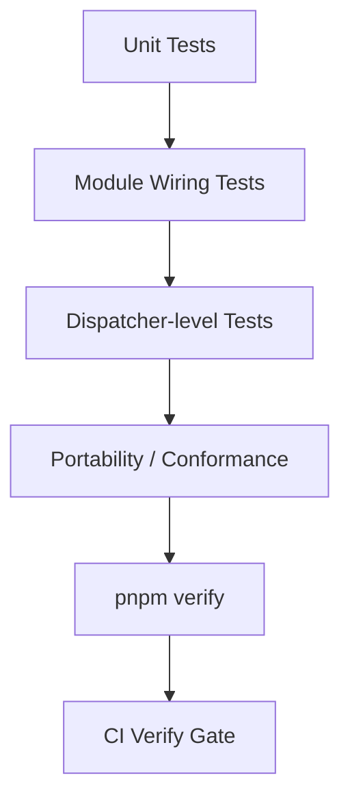

# 15장. 테스트 계층과 메인테이너 워크플로우

> **기준 소스**: [repo:docs/operations/testing-guide.md] [repo:CONTRIBUTING.md] [repo:docs/operations/release-governance.md]
> **주요 구현 앵커**: [repo:docs/operations/testing-guide.md] [ex:minimal/README.md] [ex:realworld-api/README.md]

이 장은 fluo를 “쓴다”에서 “지킨다”로 넘어가는 문턱이다. 메인테이너는 기능을 추가하는 사람일 뿐 아니라, 동작 계약을 깨뜨리지 않는 사람이어야 한다 `[repo:docs/operations/release-governance.md]`.

## 왜 이 장이 마지막이어야 하는가

테스트와 메인테이너 워크플로우는 중요하지만, 초반부에 오면 오히려 무게중심이 흐려진다. 독자가 먼저 이해해야 하는 것은 fluo가 어떻게 동작하는가이고, 그 다음에야 “그 동작을 어떻게 지킬 것인가”가 자연스럽게 들어온다. 이 장이 후반부에 오는 이유는 바로 그 순서 때문이다.

## 테스트 계층을 왜 먼저 보아야 하나

testing guide는 검증을 type safety, unit isolation, module wiring, runtime parity 순으로 정리한다 `[repo:docs/operations/testing-guide.md]`. 이 구조는 fluo가 테스트를 단순 coverage 숫자가 아니라 **신뢰 계층**으로 본다는 뜻이다.

<!-- diagram-source: repo:docs/operations/testing-guide.md, repo:package.json, repo:.github/workflows/ci.yml, pkg:testing/src/app.ts -->


이 다이어그램은 fluo의 품질 문화를 한 줄로 보여 준다. 테스트는 coverage를 채우기 위한 체크박스가 아니라, unit → wiring → dispatcher → portability → CI gate로 이어지는 **누적 신뢰 구조**다 `[repo:docs/operations/testing-guide.md]` `[repo:package.json]` `[repo:.github/workflows/ci.yml]` `[pkg:testing/src/app.ts]`.

이 계층 관점은 매우 중요하다. 모든 테스트가 같은 가치를 가지는 것이 아니라, 서로 다른 종류의 실패를 다른 레벨에서 잡는다는 뜻이기 때문이다. 책에서는 이 점을 분명히 해 줘야 한다.

## `pnpm verify`가 중요한 이유

contributing 문서는 `pnpm verify`를 사실상 표준 pre-push 체크로 둔다 `[repo:CONTRIBUTING.md]`. 이는 메인테이너 관점에서 매우 중요하다. “로컬에서 대충 됐다”가 아니라, 타입체크·빌드·린트·테스트를 모두 통과해야 한다는 공통 기준이 있기 때문이다.

이 공통 기준은 팀 규모가 커질수록 중요해진다. 메인테이너는 개별 개발자의 감각을 신뢰하는 사람이 아니라, **누구에게나 같은 검증 루프를 강제하는 사람**이기 때문이다.

```json
// source: repo:package.json
"verify": "pnpm build && pnpm typecheck && pnpm lint && pnpm test"
```

이 한 줄은 fluo 메인테이너 문화의 축약판이다 `[repo:package.json#L20-L29]`. build, typecheck, lint, test가 분리된 작업이 아니라 하나의 연속된 gate라는 점이 중요하다. 즉, 메인테이너에게 “거의 다 됐다”는 상태는 없고, verify를 통과했느냐 아니냐만 남는다.

## worktree가 왜 워크플로우의 일부인가

fluo는 worktree 기반으로 이슈 작업을 분리하는 흐름을 장려한다 `[repo:CONTRIBUTING.md]`. 이 방식은 책 집필 작업에도 잘 맞는다. 주제별/이슈별로 작업 맥락을 분리할 수 있기 때문이다.

worktree 문화는 겉보기엔 사소한 습관 같지만, 실제로는 메인테이너의 사고방식을 보여 준다. 변경 단위를 분리하고, 맥락을 섞지 않고, 검증 가능한 범위로 작업을 관리하는 태도와 연결되기 때문이다.

## CI는 로컬 규율을 어떻게 확장하는가

`.github/workflows/ci.yml`은 로컬의 verify 문화를 팀 단위 품질 게이트로 확장한 예다 `[repo:.github/workflows/ci.yml]`.

- `build-and-typecheck`는 빌드와 타입 체크를 분리된 잡으로 검증한다 `[repo:.github/workflows/ci.yml#L34-L71]`
- `lint`는 public export TSDoc까지 포함한 규율을 적용한다 `[repo:.github/workflows/ci.yml#L72-L94]`
- `test`는 scoped/full 모드로 실제 테스트를 수행한다 `[repo:.github/workflows/ci.yml#L95-L128]`
- `official-web-runtime-adapter-portability`는 Bun/Deno/Workers portability를 별도 잡으로 검증한다 `[repo:.github/workflows/ci.yml#L129-L158]`
- `verify-platform-consistency-governance`와 `verify-release-readiness`는 단순 코드 통과를 넘어 governance까지 확인한다 `[repo:.github/workflows/ci.yml#L159-L205]`

즉, CI는 단순 자동화가 아니라 **behavioral contract를 강제하는 조직적 장치**다.

```yaml
# source: repo:.github/workflows/ci.yml
build-and-typecheck:
  name: Build and typecheck

lint:
  name: Lint

test:
  name: Test

official-web-runtime-adapter-portability:
  name: Official web runtime adapter portability (${{ matrix.adapter }})

verify-platform-consistency-governance:
  name: Verify platform consistency governance

verify-release-readiness:
  name: Verify release readiness
```

이 발췌는 CI가 단일 test 잡 하나로 끝나지 않는다는 점을 보여 준다 `[repo:.github/workflows/ci.yml]`. fluo의 verify 문화는 빌드, 타입, 린트, 테스트, portability, governance, release readiness를 서로 다른 gate로 분리해 둔다. 즉, 품질은 하나의 체크가 아니라 **여러 차원의 검증 묶음**이다.

## testing 패키지가 왜 중요한가

`createTestApp(...)`은 이 장에서 반드시 소개해야 할 실제 코드다 `[pkg:testing/src/app.ts]`.

```ts
// source: pkg:testing/src/app.ts
export async function createTestApp(options: TestingModuleOptions): Promise<TestApp> {
  const app = await bootstrapApplication({
    ...options,
    middleware: [createTestRequestContextMiddleware()],
  });

  const dispatch: TestApp['dispatch'] = async (request: TestRequestWithOptions): Promise<TestResponse> => {
    return makeRequest(app.dispatcher, request);
  };

  return {
    request,
    dispatch,
    close: async () => {
      await app.close();
    },
  };
}
```

이 코드가 보여 주는 것은 “서버를 띄우지 않고도 real runtime stack을 통과하는 테스트가 가능하다”는 점이다 `[pkg:testing/src/app.ts#L57-L82]`. 즉, fluo 테스트는 모의 객체만 쓰는 세계와 실제 런타임을 전부 올리는 세계 사이에 아주 실용적인 중간 지점을 제공한다.

## 왜 `surface.test.ts`가 특별히 중요한가

대부분의 프로젝트는 기능 테스트만 하고 public surface 자체는 비교적 느슨하게 관리한다. 하지만 `surface.test.ts`는 아예 export contract를 테스트로 고정한다 `[pkg:testing/src/surface.test.ts]`.

이 철학은 메인테이너급 품질의 핵심이다.

- 무엇이 공개 API인지 테스트가 증명한다.
- 무엇이 공개되면 안 되는지 역시 테스트가 증명한다.
- `package.json`의 exports map과 빌드 산출물의 정렬도 검사한다.

이 말은 곧, 문서와 릴리스와 테스트가 서로 분리된 concern이 아니라는 뜻이다. public API 하나를 바꾸는 일은 코드 변경인 동시에 contract 변경이며, 따라서 테스트와 문서와 release note까지 모두 연결된다.

## 로컬 → 패키지 → CI → 릴리스로 이어지는 검증 사슬

이 장을 읽는 독자가 최종적으로 가져가야 하는 이미지는 다음과 같다.

1. 개발자는 로컬에서 `pnpm verify`를 돌린다 `[repo:package.json]`
2. 테스트 패키지는 module/app/portability/conformance 수준의 헬퍼를 제공한다 `[pkg:testing/src/app.ts]` `[pkg:testing/src/surface.test.ts]`
3. CI는 이를 여러 개의 조직적 gate로 재검증한다 `[repo:.github/workflows/ci.yml]`
4. release governance는 이 결과를 기반으로 안정성 계약을 유지한다 `[repo:docs/operations/release-governance.md]`

즉, 메인테이너 워크플로우는 좋은 습관의 모음이 아니라 **코드·테스트·도구·거버넌스가 연결된 검증 사슬**이다.

## 이 장의 마지막 메시지

이 책의 마지막 장이 여기서 끝나는 이유는 분명하다. fluo를 깊게 이해한 사람의 최종 모습은 “기능을 더 빨리 만드는 사람”이 아니라, **시스템이 앞으로도 계속 신뢰 가능하도록 지키는 사람**이기 때문이다.

## public surface도 테스트된다는 점

메인테이너급 품질은 기능 테스트만으로 끝나지 않는다. `packages/testing/src/surface.test.ts`는 public API surface 자체를 테스트한다 `[pkg:testing/src/surface.test.ts]`.

```ts
// source: pkg:testing/src/surface.test.ts
it('keeps the root barrel focused on module/app helpers', () => {
  expect(testing.createTestingModule).toBeTypeOf('function');
  expect(testing.createTestApp).toBeTypeOf('function');
  expect('createMock' in testing).toBe(false);
  expect('makeRequest' in testing).toBe(false);
});
```

이 테스트는 단순 사소한 검증이 아니다. “무엇을 export해야 하고 무엇은 export하면 안 되는가”조차 behavioral contract라는 뜻이다. 이 수준까지 가야 비로소 책의 마지막 장이 메인테이너다운 무게를 갖게 된다.

## surface contract를 더 자세히 보면

`surface.test.ts`는 단순 함수 존재 여부만 보는 것이 아니다. 같은 파일 안에서 subpath export, package.json exports map, peer dependency까지 함께 확인한다 `[pkg:testing/src/surface.test.ts]`.

```ts
// source: pkg:testing/src/surface.test.ts
it('keeps published subpath metadata aligned with the built surface', () => {
  const packageJson = JSON.parse(readFileSync(new URL('../package.json', import.meta.url), 'utf8')) as {
    exports: Record<string, { import: string; types: string }>;
    peerDependencies: Record<string, string>;
  };

  expect(packageJson.exports['./platform-conformance']).toEqual({
    types: './dist/platform-conformance.d.ts',
    import: './dist/platform-conformance.js',
  });
  expect(packageJson.peerDependencies.vitest).toBe('^3.0.8');
});
```

이 테스트는 “public API가 무엇인가”를 코드 수준에서 못 박는다 `[pkg:testing/src/surface.test.ts#L37-L60]`. 메인테이너 관점에서는 이것이 매우 중요하다. export map이 어긋나면 문서, 타입, 번들, 사용 예제가 동시에 깨질 수 있기 때문이다.

## portability gate가 왜 특별한가

CI 잡 중에서 특히 눈여겨봐야 할 것은 web runtime adapter portability 잡이다 `[repo:.github/workflows/ci.yml#L129-L158]`. 많은 프로젝트는 Node 환경에서 통과하면 만족하지만, fluo는 Bun, Deno, Cloudflare Workers까지 별도 matrix로 검증한다.

이것이 의미하는 바는 단순하다. fluo가 README에서 말하는 “run anywhere”는 마케팅 문구가 아니라, **실제 CI 잡으로 강제되는 약속**이라는 뜻이다 `[repo:README.md]` `[repo:.github/workflows/ci.yml]`.

이 장은 이 점을 분명히 해야 한다. 메인테이너는 기능이 돌아가는지만 보는 사람이 아니라, 프레임워크가 약속한 portability와 governance를 실제로 지키는 사람이다.

## 메인테이너 워크플로우를 시간 순서로 보면

이 장의 내용을 시간 순서로 나열하면 다음과 같다.

1. 로컬에서 단위/통합/e2e/dispatcher 테스트를 작성한다.
2. `pnpm verify`로 build/typecheck/lint/test를 한 번에 통과시킨다 `[repo:package.json]`.
3. worktree로 변경 범위를 격리한다 `[repo:CONTRIBUTING.md]`.
4. CI가 portability/governance/release readiness까지 재검증한다 `[repo:.github/workflows/ci.yml]`.
5. release governance가 public contract와 maturity expectation을 유지한다 `[repo:docs/operations/release-governance.md]`.

즉, 메인테이너 워크플로우는 도구 사용법 묶음이 아니라 **변경을 신뢰 가능한 릴리스로 바꾸는 시간적 흐름**이다.

## 독자가 마지막에 가져가야 할 질문

이 책의 마지막 장은 독자에게 다음 질문을 남겨야 한다.

- 나는 기능을 추가할 줄만 아는가?
- 아니면 그 기능이 시스템의 public contract를 깨뜨리지 않는지 증명할 수 있는가?

fluo가 메인테이너에게 요구하는 능력은 후자다. 그래서 이 장은 책의 결론으로서 충분히 무거워야 한다.

## 이 장의 핵심

메인테이너는 코드를 더 많이 아는 사람만을 뜻하지 않는다. 메인테이너는 구조를 이해하고, 검증 계층을 통과시키고, 문서와 예제를 함께 관리하며, 릴리스 거버넌스를 존중하는 사람이다 `[repo:docs/operations/release-governance.md]`.

좀 더 강하게 말하면, 메인테이너는 기능을 추가하는 사람이라기보다 **시스템의 신뢰를 유지하는 사람**이다. 이 관점이 책의 마지막 장에서 분명해져야, 독자는 fluo를 단순 프레임워크 사용법이 아니라 하나의 엔지니어링 문화로 받아들이게 된다.
