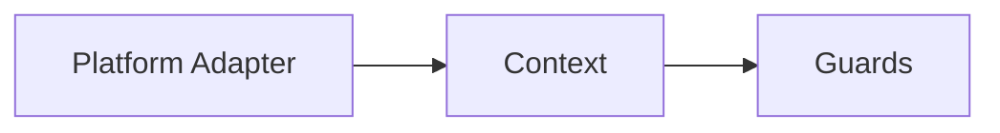

# KSR: fluo 출처 표기 규칙

이 작업 공간은 fluo의 실제 문서, 코드, 예제에 대한 모든 주장을 저장소 파일로 되돌아갈 수 있게 만드는 **가벼운 출처 표기 형식**을 사용한다.

## 접두어

- `repo:` → 저장소 루트
- `pkg:` → `packages/`
- `ex:` → `examples/`

## 인라인 참조

실제 문서나 코드에 근거한 문장은 대괄호 형식의 인라인 참조를 붙인다.

- Format: `[repo:path/to/file]`
- Format: `[pkg:package-name/path/to/file]`
- Format: `[ex:example-name/path/to/file]`

예시:

- The docs hub defines the official getting-started flow `[repo:docs/README.md]`.
- The minimal bootstrap uses an explicit Fastify adapter `[ex:minimal/src/main.ts]`.
- The HTTP package describes the request pipeline as binding, validation, guards, interceptors, and response writing `[pkg:http/README.md]`.

## 줄 번호 앵커

주장이 파일의 특정 구간에 의존한다면 GitHub 스타일의 줄 번호 접미사를 붙인다.

- Format: `[repo:path/to/file#L10-L20]`

예시:

- Runtime bootstrap uses `fluoFactory.create(...)` in the minimal example `[ex:minimal/src/main.ts#L10-L13]`.
- The realworld API example binds a DTO with `@RequestDto(CreateUserDto)` `[ex:realworld-api/src/users/users.controller.ts#L18-L22]`.

## 코드 블록 출처

코드 블록이 저장소의 실제 코드에서 복사되었거나 매우 가깝게 각색되었다면, 코드 블록 앞에 출처를 적는다.

```md
// source: ex:minimal/src/main.ts
```

or

```md
<!-- source: repo:docs/getting-started/first-feature-path.md -->
```

## 섹션 기준 문서

하나의 섹션이 특정 문서 하나를 주로 바탕으로 한다면, 섹션 상단에서 명시한다.

```md
> **기준 소스**: [repo:docs/concepts/di-and-modules.md]
```

개념 문서, 패키지 README, 예제 README를 섹션 단위로 요약할 때 사용한다.

## 챕터 헤더 규칙

앞으로 생성하는 모든 chapter 파일은 상단에 간결한 출처 헤더를 두어, 이 장의 개념 근거와 코드 앵커가 즉시 보이도록 한다.

```md
# 장 제목

> **기준 소스**: [repo:docs/some-doc.md] [ex:some-example/README.md]
> **주요 구현 앵커**: [ex:some-example/src/file.ts] [pkg:some-package/src/file.ts]
```

`기준 소스`는 개념 설명의 근거가 되는 문서에, `주요 구현 앵커`는 코드 해설에 사용할 실제 파일에 붙인다.

## 도표 출처

도표가 실제 fluo 동작을 설명한다면, 그 구조가 어떤 문서나 코드에서 왔는지도 함께 적어야 한다.

권장 형식:

```md
<!-- diagram-source: repo:docs/concepts/http-runtime.md -->

```

도표가 여러 자료를 합쳐 만든 것이라면 쉼표로 함께 적는다.

```md
<!-- diagram-source: repo:docs/concepts/architecture-overview.md, ex:minimal/src/main.ts -->
```

이 규칙은 Mermaid 같은 diagram-as-code 블록이 실제 저장소 자료와 분리되지 않게 해준다.

## 집필 규칙

문단이 다음 중 하나에 대해 사실 판단을 한다면:

- official learning order
- package responsibilities
- example behavior
- runtime or DI behavior
- testing or release policy

적어도 하나의 소스 파일을 가리켜야 한다.

chapter 초안에서는 특히 다음 위치에 적용한다.

- opening framing paragraphs
- “why this matters” sections
- code walkthrough introductions
- comparison tables
- diagram captions or diagram headers

## 이 작업 공간에서 이미 검증한 예시

- 루트 철학과 패키지 구분: `[repo:README.md]`
- 문서 허브 구조: `[repo:docs/README.md]`
- 예제 읽기 순서: `[ex:README.md]`
- 최소 런타임 부트스트랩: `[ex:minimal/src/main.ts]`
- RealWorld DTO 바인딩: `[ex:realworld-api/src/users/users.controller.ts]`
- 인증 토큰 발급: `[ex:auth-jwt-passport/src/auth/auth.service.ts]`
- metrics / terminus 등록: `[ex:ops-metrics-terminus/src/app.ts]`
